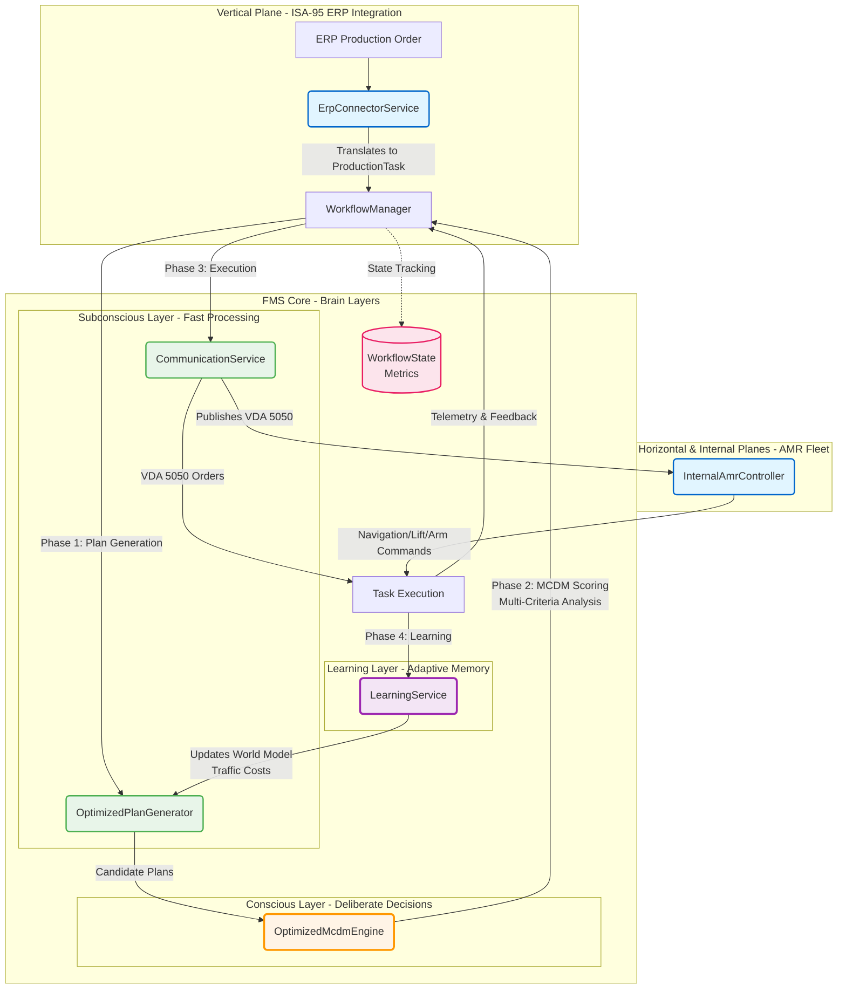

# System Architecture (High Level)

This diagram shows the main components, tri-planar communication flow, and brain-inspired cognitive layers.

## Key Components

- **ErpConnectorService** - Vertical plane: ERP integration (ISA-95)
- **OptimizedPlanGenerator** - Subconscious layer: Fast pattern-based plan generation
- **OptimizedMcdmEngine** - Conscious layer: Deliberate multi-criteria decision making
- **CommunicationService** - Subconscious layer: Automated VDA 5050 + internal command execution
- **LearningService** - Learning layer: Experience-based world model updates
- **InternalAmrController** - Internal plane: AMR subsystem command translation
- **WorkflowManager** - Central orchestrator of all cognitive and execution phases

## Architecture Overview

### **Tri-Planar Communication Model**

1. **Vertical Plane (ISA-95 ERP ↔ FMS)**
   - ERP systems issue production orders
   - `ErpConnectorService` translates orders into FMS tasks
   - Bidirectional communication for order status and completion

2. **Horizontal Plane (FMS ↔ AMR Fleet)**
   - `CommunicationService` publishes VDA 5050 orders
   - AMRs report status, position, and telemetry
   - Fleet-wide coordination and task distribution

3. **Internal Plane (Intra-AMR Communication)**
   - `InternalAmrController` manages subsystem commands
   - Navigation, lifting, and arm control commands
   - Real-time command execution and feedback

### **Conscious Layer (Decision-Making & Learning)**

The FMS implements a conscious layer through:
- **OptimizedMcdmEngine**: Multi-Criteria Decision Making with weighted scoring
  - Time optimization with exponential decay
  - Non-linear resource utilization
  - Dynamic weight adjustment based on fleet state
- **LearningService**: Continuous improvement through feedback
  - Updates world model with actual execution times
  - Adjusts traffic cost estimates
  - Improves future plan generation accuracy

### **WorkflowManager: Orchestration Hub**

The `WorkflowManager` coordinates all workflow phases:
1. **PLANNING**: Generate and evaluate candidate plans
2. **EXECUTING**: Dispatch orders and monitor execution
3. **LEARNING**: Update models with actual performance data
4. **State Tracking**: Concurrent workflow monitoring with metrics

## Key Components

### Services

- **`ErpConnectorService`** - Fetches and translates ERP orders into FMS tasks
- **`OptimizedPlanGenerator`** - Generates valid assignment plans with hard constraint pruning
- **`OptimizedMcdmEngine`** - Advanced MCDM scoring with exponential time penalties and non-linear resource modeling
- **`CommunicationService`** - Handles VDA 5050 communication and internal AMR commands
- **`LearningService`** - Feedback loop that updates traffic costs and improves predictions
- **`InternalAmrController`** - Translates VDA 5050 into subsystem-specific commands
- **`WorkflowManager`** - Orchestrates end-to-end task execution with state tracking
- **`LoggingService`** - Centralized operational metrics and structured logging

### Models

- **`ProductionTask`** - FMS-internal representation of work to be done
- **`AssignmentPlan`** - A candidate plan assigning an AMR to a task
- **`AmrState`** - Current state and capabilities of an AMR
- **`WorkflowState`** - Tracks task execution state, transitions, and metrics
- **`VDA5050/*`** - Standard AMR communication protocol models
- **`ISA95/*`** - Manufacturing operations management models

## Design Principles

1. **Separation of Concerns**: Each service has a single, well-defined responsibility
2. **Dependency Injection**: All services use constructor injection for testability
3. **Async/Await**: Non-blocking I/O for concurrent task processing
4. **Metrics-Driven**: Comprehensive logging of operational metrics
5. **Feedback Loops**: Continuous learning from execution results

---

**Note**: Keep this diagram and documentation in sync with code changes. When renaming or refactoring classes, update this file accordingly.
