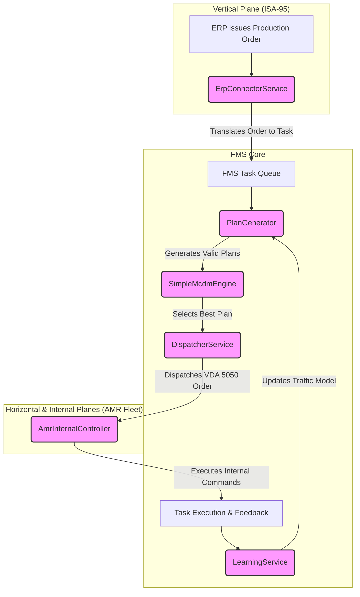

# System architecture (high level)

This diagram shows the main components and data flow used in the simulation.

Notes
- Key files:
    - `Services/PlanGenerator.cs` — plan candidate generation and hard pruning.
    - `Services/SimpleMcdmEngine.cs` — scoring (time, suitability, battery) and selection logic.
    - `Services/LearningService.cs` — simple feedback loop that updates traffic costs via `PlanGenerator.UpdateTrafficCost`.
    - `Services/JulesMqttClient.cs` / `Services/DispatcherService.cs` — publish VDA 5050 orders to AMRs.
    - `Services/InternalAmrController.cs` — translates VDA 5050 into internal AMR commands using `Models/InternalAmrCommand.cs`.

Keep the diagram and notes in sync with code: if you rename classes, update this file.
